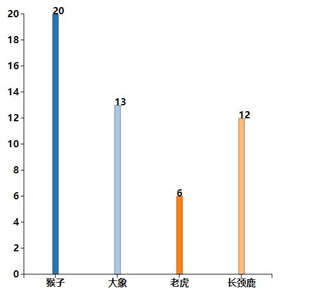
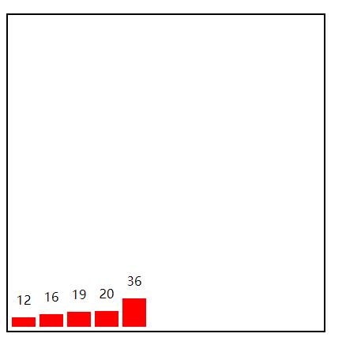
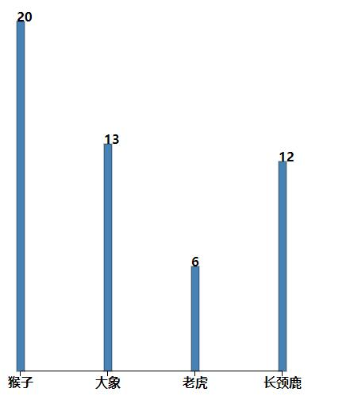
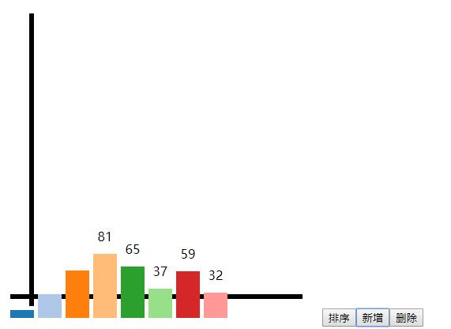
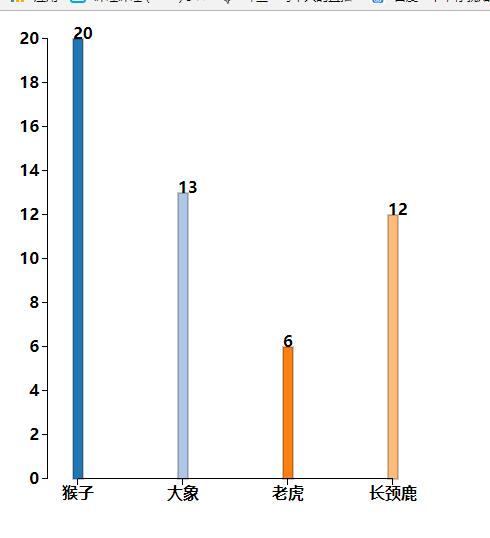
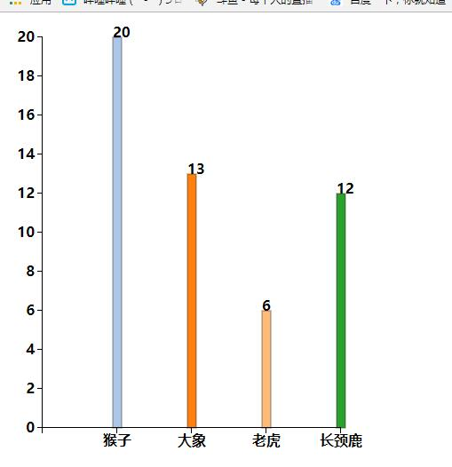
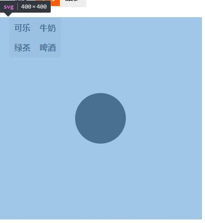

12/22/2017 10:26:46 PM 

    //颜色
    let color=d3.scale.category20();
    //svg尺寸
    var margin = {top: 20, right: 40, bottom: 40, left: 40},
    width = 500 - margin.left - margin.right,
    height = 500 - margin.top - margin.bottom;
    //数据集
    var dataset=[{"key":"猴子","value":20},{"key":"大象","value":13},{"key":"老虎","value":6},{"key":"长颈鹿","value":12}];
    //线性比例尺
    var linearScale=d3.scale.linear()  
     .domain([0,d3.max(dataset,function(d){ return d.value;})])
     .range([0,height]); 
    //序数比例尺
    let str=[];
    dataset.forEach(function(n,i){str.push(i*Math.floor(width/dataset.length)+40)});
    console.log(str)
    var ordinalScale  = d3.scale.ordinal()
    	.domain(dataset.map(function(d){ return d.key;}))
    .rangeRoundPoints([0,width],1);
    //创建svg标签
    var svg = d3.select("body").append("svg")
    .attr("width", width + margin.left + margin.right)
    .attr("height", height + margin.top + margin.bottom)
      .append("g")
    .attr("transform", "translate(" + 0 + "," + margin.top + ")");
    //创建矩形条
    var rects=svg.selectAll("rect")
    	.data(dataset)
    	.enter()
    	.append("rect")
    	.attr({
    		x:function(d){ return ordinalScale(d.key)+35; },
    		y:function(d,i){ return height-linearScale(d.value); },	//矩形起始纵坐标
    		width:10,
    		height:function(d){ return linearScale(d.value); },	//矩形的条高
    		fill:function(d,i){ return color(i); },
    		stroke:'black',
    		'stroke-width':.5
    	});
    //创建矩形条的文本
    var texts=svg.selectAll("text")
    	.data(dataset)
    	.enter()
    	.append("text")
    	.text( function(d){ return d.value; })
    	.attr({
    		x:function(d){ return ordinalScale(d.key)+35; },
    		y:function(d,i){ return height-linearScale(d.value); }
    	});
    //创建坐标轴
    let xAxis=svg.append("g")
     .attr("transform", "translate(" +40 + "," + height + ")")
    .attr("class", "x axis")
    .call(d3.svg.axis().scale(ordinalScale).orient("bottom"));
    	
    let yAxis=svg.append('g')
     .attr('transform','translate('+margin.left+','+0+')')
    .attr("class", "y axis")
    	.call(d3.svg.axis().scale(linearScale.range([height,0])).orient("left"));

###解决X轴问题的关键 ordinal.rangePoints  &&  ordinal.rangeBands
> rangepoints支持2个参数，一个是连续的数组区间，一个是两侧的padding，自动计算step间隔

> rangeBands多支持一个参数，padding变成内部间隔，多一个outerpadding  **(interval,padding,outerpadding)**

 
12/21/2017 10:25:59 AM  

**数组的各项操作**

- .min(array[,accessor])
- .max(array[,accessor])
- .sum(array[,accessor])
- .mean(array[,accessor])平均数
- .median(array[,accessor])中位数
- .shuffle(array)
> 对于字符串数字可以根据JS的弱类型特点,(+'str')把它变成一个number型

**映射**

- .map（[object][,key])
- .has(key)
- .get(key)
- .set(key,value)
- .remove(key)
- .keys()
- .values()
- .forEach(F)

**集合**

- .set([array])
> **集合中不存在重复项，方法和映射一样**

**嵌套结构**

> 使用键对数组中的大量对象进行分类

- d3.nest().key(function)[,.sortKeys(comparator)][,sortValues(comparator)].entries(array)  

**> 创建一个嵌套结构，指定key，可以排序，然后指定应用嵌套的数组**

	{
		let width=400,height=400,step=35,rectWidth=30,rectHeight=[12,16,19,20,36],padding=5;
		/*step为一个矩形占的宽度，加空白部分的宽度，rectWidth为涂色的不算空白部分的宽度*/
		let SVG2=d3.select('body').append('svg').attr('width',width).attr('height',height).style('border','2px solid black')
		let rect=SVG2.selectAll("rect").data(rectHeight).enter()
		 			 .append("rect").attr('x',function(d,i){
						  return padding+i*step
					  })
					 .attr('y',function(d,i){
						 return height-d-padding;
					 })
					 .attr('width',rectWidth)
					 .attr('height',function(d){
						 return d
					 })
					 .attr('fill','red')
		let property={
			'text-anchor':'middle',
			'x':function(d,i){return padding+i*step},
			'y':function(d,i){return height-d-padding},
			'dx':rectWidth/2,
			'dy':'-1rem',
			}
		let text=SVG2.selectAll('text').data(rectHeight).enter()
					 .append('text')
					 .attr(property)
					 .text(function(d){
						 return d
					 })
		}

**> 画了一个柱状图，后来attr写累了发现可以一次性用对象接收所有属性**

**> text-anchor:start middle end文字位置**

## 比例尺 ##

## 坐标轴 ##

>**\>> 坐标轴有path的主直线、line的刻度、text的文字也许可以加上circle点**

    
	//svg尺寸
    var margin = {top: 20, right: 40, bottom: 40, left: 20},
    width = 500 - margin.left - margin.right,
    height = 500 - margin.top - margin.bottom;
    //数据集
    var dataset=[{"key":"猴子","value":20},{"key":"大象","value":13},{"key":"老虎","value":6},{"key":"长颈鹿","value":12}];
    //线性比例尺
    var linearScale=d3.scale.linear()  
     .domain([0,d3.max(dataset,function(d){ return d.value;})])
     .range([0,height]); 
    //序数比例尺，这里动态根据数据集的长度计算间隔
    let str=[];
    dataset.forEach(function(n,i){str.push(i*Math.floor(width/dataset.length))});
    console.log(str)
    var ordinalScale  = d3.scale.ordinal()
    	.domain(dataset.map(function(d){ return d.key;}))
    .range(str);
    //创建svg标签
    var svg = d3.select("body").append("svg")
    .attr("width", width + margin.left + margin.right)
    .attr("height", height + margin.top + margin.bottom)
      .append("g")
    .attr("transform", "translate(" + 0 + "," + margin.top + ")");
    //创建矩形条
    var rects=svg.selectAll("rect")
    	.data(dataset)
    	.enter()
    	.append("rect")
    	.attr({
    		x:function(d){ return ordinalScale(d.key)+margin.left/2+5; },
    		y:function(d,i){ return height-linearScale(d.value); },	//矩形起始纵坐标
    		width:10,
    		height:function(d){ return linearScale(d.value); },	//矩形的条高
    		fill:function(d){ return "steelblue"; },
    		stroke:'black',
    		'stroke-width':.5
    	});
    //创建矩形条的文本
    var texts=svg.selectAll("text")
    	.data(dataset)
    	.enter()
    	.append("text")
    	.text( function(d){ return d.value; })
    	.attr({
    		x:function(d){ return ordinalScale(d.key)+margin.left/2+5; },
    		y:function(d,i){ return height-linearScale(d.value); }
    	});
    //创建坐标轴
    svg.append("g")
     .attr("transform", "translate(" + margin.left + "," + height + ")")
    .attr("class", "x axis")
    .call(d3.svg.axis().scale(ordinalScale).orient("bottom"));

##每日问题
      min(array[,accessor])   /*已解决*/
	  /*accessor参数的作用是忽略未定义的或者是无效值如NaN undefined*/
·

 
**> 1、不知道为什么前面3个固有数据没有数值**

**> 2、加载数据坐标轴就没有刻度了**

**> 2、排序算法还不灵活**

 

**> X轴有问题（ 已解决）**

----------
----------

12/20/2017 11:15:54 AM 
###画一个简单的SVG图形   圆

        let width=400;
		let height=400;
	    var svg=d3.select('body')
          		  .append("svg")
          		  .attr('width',width)
          		  .attr('height',height)
		svg.append('circle')
           .attr('cx',width/2).attr('cy',height/2).attr('r','50px')/*width/2这会让图形画到SVG画布中间*/
      /*svg定义了一个宽高400的画布，然后在SVG上画了一个半径为50的圆*/

# 选择集 #返回的对象叫selection

.select()

.selectAll()  
      

     d3.selectAll('td').attr('like',/*用attr取属性*/
		function(d,i){
		  let s='';
		  console.log(this);//当前元素     
		  console.log(d);//当前元素绑定的数据
		  console.log(i);//当前元素在选定集中的序数
		  this.id=='test'?s='yes':s='No';//直接使用this.属性    
		  return s
		  }
		)

     

> selection.empty()只是判断选择集是否为空，返回的是布尔值，JQ的empty()是清空方法

**添加插入删除**selection.append(name).insert(name,[before name]).remove()  

**数据绑定** .data().datum()
> **在选择集中添加新元素，选择集绑定的数据会继承给新元素**

**数据绑定的三种操作** update、enter、exit

    let enter=d3.select('body').selectAll('#newP')
		.data([1,2,3,4,5]).enter();

		console.log(enter)
		enter.append('p').text(function(d){return d;})
> 上面方法append的新元素p，并不拥有Id newP   ，只是 一个纯粹的p元素

> **先选择一个空集绑定数组然后选择enter部分，添加元素进去，修改值**

> update直接修改内容  exit直接删除元素   enter如上

# **.each()**  	
		
	update
		.data([{a1:1},{a1:1},{a1:1},{a1:1},{a1:1}])
		.text(function(d){return d.a1})
		.each(function(d){
			d.a2=2;
			d.a1=3;
			// console.log(d)
		}).text(function(d2,i){console.log(d2);return d2.a1})

**上面函数通过each方法修改了绑定的数据再次修改内容**

# **.call(函数)** #
	function learn(n){
				console.log(n)
				// console.log(this)
				this.each(function(n,i){
					console.log(n)
					console.log(n.a1)
					n.a1+=1
				})
			}

		update.call(learn).text(function(n){return n.a1})/*通过call的方式将自己传给learn函数，在函数中修改了值，重新修改内容*

·

	function learn(n){
				console.log(n)
				this.each(function(n,i){
					console.log(n)
					console.log(n.a1) 
					n.a1=Math.floor(Math.random()*10000);
				})
				cldata(data11)
				
			}

		function cldata(arr){
			arr.sort(sor('a1'))
				function sor(X){
					return function(a,b){
						var value1 = a[X];
        				var value2 = b[X];
						return value1 - value2;
					}					
				}
				// console.log(data11)
		}

		update.call(learn).data(data11).text(function(n){return n.a1})

**update为选择集，将自己作为参数传给learn函数，each循环生成新的随机数，调用cldata函数升序排序** 
**重新绑定数据，修改文本内容**

##每日问题
      d3.selectAll('td').attr('like',d3.select(this).attr('id')=='test'?'yes':'No')   /*已解决*/
	  /*取不到id的值*/
·

      update
		.data([1,2,3,4,5])
		.text(function(d){return d})
		.each(function(d){
			d+=1;
			console.log(d)
		}).text(function(d,i){console.log(d);return d}) /*未解决*/
		/*再次修改内容时，值没有变化*/	

----------
